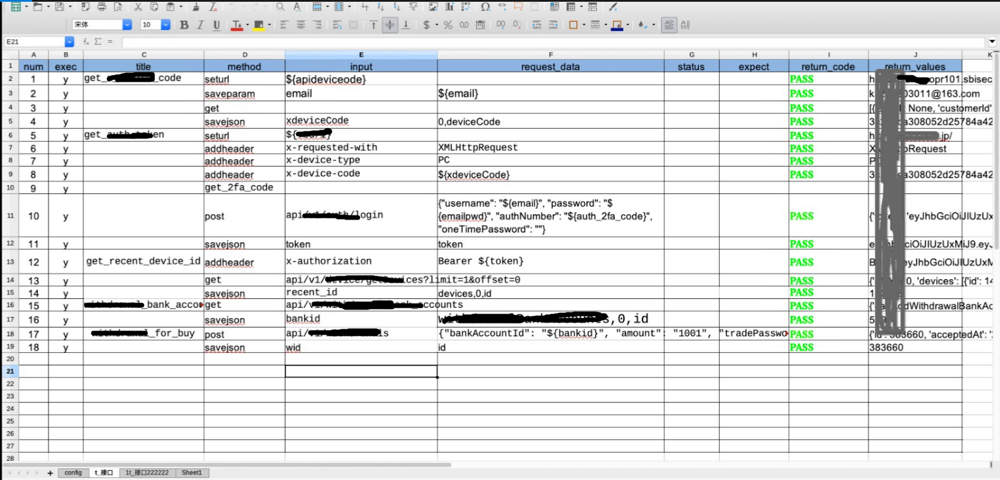
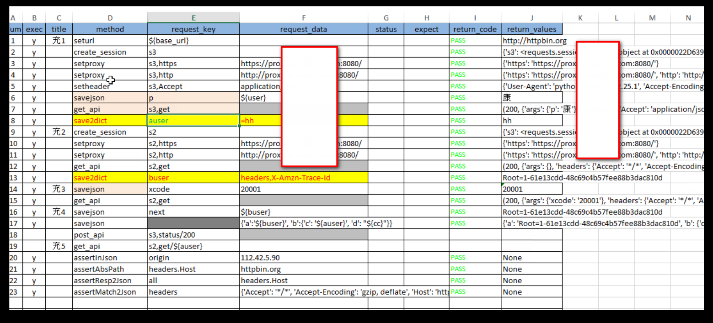

# ks_web_allure         作者:kangs2008

## 版本：V 1.0
- 可自定义测试报告文件夹，以当天时间或者以时分秒来生成报告文件夹
- allure报告输出
- log报告文件输出
- 错误自动截图和可按需截图和截图标记

## 项目说明
- 本框架是基于**pytest+allure**设计

## 技术栈
- requests
- pytest
- pytest-html
- pytest-allure
- openpyxl
- logging
- cv2

## 截图

